# twobilliontoolkit

## Project Description

This repository is a branch of the twobilliontoolkit for the ArcGIS Pro add-in portion. The add-in will be added to your ArcGIS project and you can use it whenever you have that project opened. It contains a few tools contained within the add-in, if you are curious about them or have any questions, refer to the ArcGIS Pro Add-in User Manual document on the network drive.

## Table of Contents

- [Project Description](#project-description)
- [Installation](#installation)
- [Usage](#usage)
- [Configuration](#configuration)
- [Contributing](#contributing)
- [License](#license)

## Installation

To install and set up the twobilliontoolkit package, follow these steps:

First ensure that you have ArcGIS Pro 3.x installed on your machine. If not, refer to the [Get Started pages](https://pro.arcgis.com/en/pro-app/latest/get-started/get-started.htm)

Next you will need to install the Add-in, to do so:

1. Locate the ArcGIS Pro Add-in called twobillionarcgisaddin.esriAddinX. 
Note:
If you are on the NRCAN network, you can find the add-in at \\vic-fas1\projects_a\2BT\02_Tools\twobilliontoolkit\twobillionarcgisaddin\bin\Debug\net6.0-windows\twobillionarcgisaddin.esriAddinX.
2. Double-click the file and you will see a pop-up. 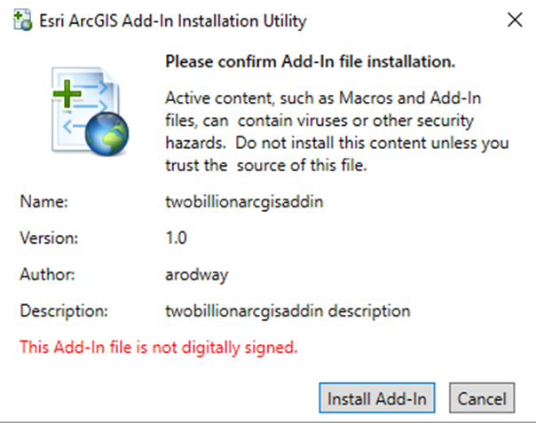
3. Click the Install Add-in button and you will then see another popup saying the add-in was installed successfully. 
4. Dismiss this popup by clicking OK. 
5. Open ArcGIS Pro and verify it was installed correctly by navigating to Settings>Add-in Manager 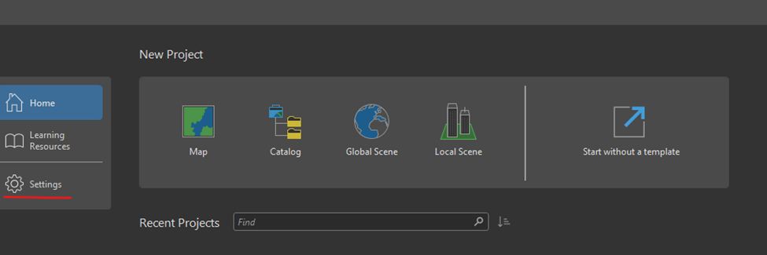 
    ```
    Note:
    You should see the twobillionarcgisaddin add-in in this list like shown above, if not you may need to re-install the add-in or ArcGIS Pro.
    ```
6. You can then open a project, or start a new project and you may notice a new tab at the top of the window called Add-in. 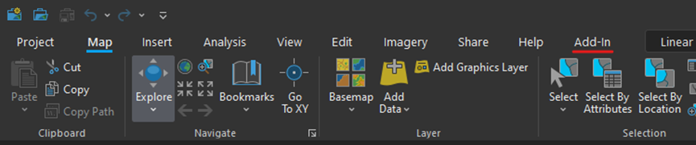
7. The click the button Two Billion Trees Tools (or hover to see a description). 

    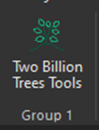


Another thing that you will need to do is to add the database connection file inside your ArcGIS pro project. To do that, you can do the following: 

1. Open the ArcGIS Pro and choose a project you wish to connect the database to.
2. In the Insert tab at the top, click the Connections button dropdown. 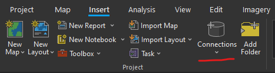
3. Click the Database expand, then choose Add Database. 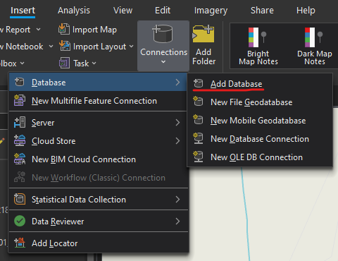
4. Navigate the file explorer to the database_connection.sde file.
    ```
    Note:
    If on the network, it should be located at \\vic-fas1\projects_a\2BT\02_Tools\EsriAddIns\database_connection.sde
    ```
5. After selecting the file, verify that it was added to the project. It should be under the Databases dropdown in the catalog. 

    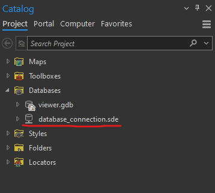
6. The database has now been added to the project, if you want to check the tables you can expand the .sde file, it will prompt the user to enter a username and password in a popup, doing so successfully will grant the user permission to use the connection.
```
Note:
The connection should only stay active while the current project is active. If the user closes and reopens the project or ArcGIS Pro, it will prompt the user to re-enter the authentication.
```

You should then be set up to use the tools in the add-in!

## Usage

Once you have installed everything you need, you can start using the add-in to make your life easier! After clicking the Two Billion Trees Tools button, you will notice a new dock pane open on the right called the Two Billion Trees Tools Logistics Tab. 

[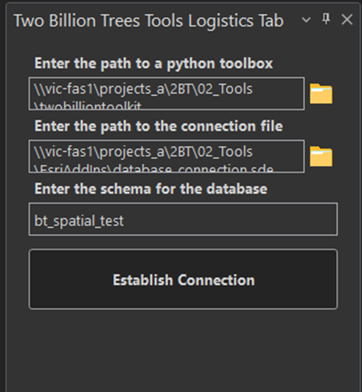](../images/logistics_tab.png)

```
Note:
These fields will not be filled in for you, you will need to write them in or browse to a file location that is suitable for that entry.
```

If you are on the NRCAN network, 
- Python toolbox can be found at \\vic-fas1\projects_a\2BT\02_Tools\twobilliontoolkit\twobillionarcgistoolboxes\twobillionarcgistoolboxes.pyt
- Connection file can be found at \\vic-fas1\projects_a\2BT\02_Tools\EsriAddIns\database_connection.sde

After filling in those fields, you can click the Establish Connection button to connect to the database and depending on how you set up your connection file or if you are using the provided one an authentication window will pop up. 

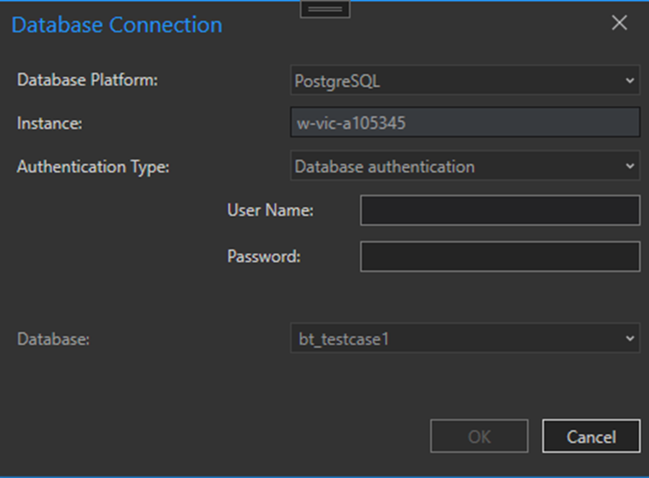
 
Fill in your authentication credentials (Database credentials, not your computer credentials) and after verifying that you entered the correct username and password, it will open the Two Billion Trees Tool List where all the processes will be gathered in one place for ease of access.

```
Note:
If you successfully verify to the database connection in this step, it will open a database connection pool in your current ArcGIS Pro instance so you will not need to reverify to that connection again unless you close Arc and reopen at some point.
```

Below is what the tool list looks like, it currently has placeholder buttons for tools that have not been created yet but will be filled in the future. It will also allow the user to cycle through the two billion trees projects in the geodatabase one at a time to create a sort of automatic (with some manual steps) pipeline making it easier for the user/analyst. Finally, when the user is done with the current working project, they can click the Finish Working Project button at the bottom, and it will flag the entry in the raw_data_tracker table in the database to indicate the analyst has processed it.

[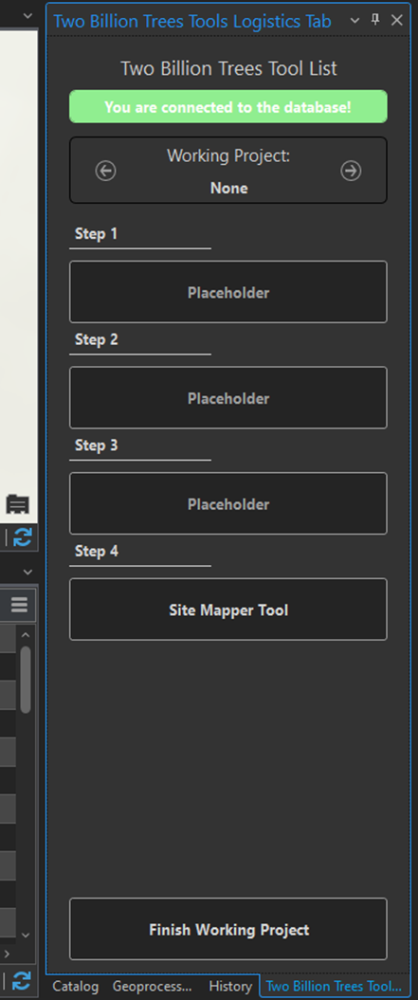](../images/tool_list.png)
 
### Step 1: TBD
TBD.

### Step 2: TBD
TBD.

### Step 3: TBD
TBD.

### Step 4: Site Mapper
The Site Mapper tool in this add-in is quite handy, it allows the user to map site ids to the spatial geometries.

The first thing that you will see when clicking the Site Mapper tool button is a new dock pane labeled Site Mapper Data Grid which contains the entries in the database relating the project numbers and the site ids.  

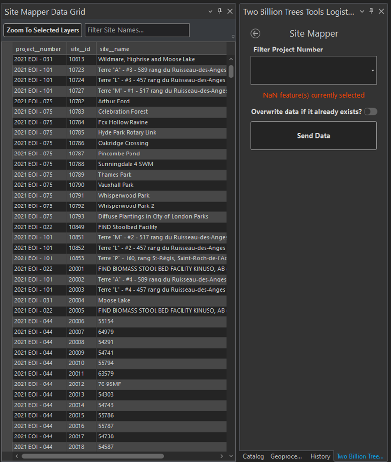

You may also notice that the original logistics dock pane view has changed to a Site Mapper specific version. You can take the back arrow in the top left corner to go back to the list of tools, or you can explore this tool by using the dropdown menu to select a project number. 

Selecting a project number in the dropdown menu will do two things:
- If a featureclass is on the map with a corelating project number, it will select all features on the map that for that featureclass (deselecting everything else).
- Another dropdown menu will appear for the user to select a site id.

The second dropdown menu for Site ID is important for sending the data to the database. The user will need to fill in that input and select any number (>= 1) of features in the attribute table of the corresponding feature class and hit the Send Data button in the dock pane.
 
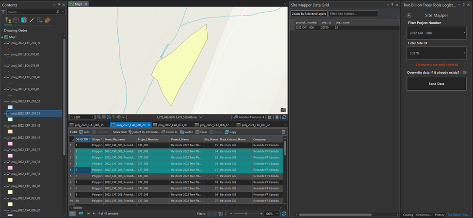

Two things are done when completing these steps,
- All of the selected layers polygons are added to the database with the site id (hence the name Site Mapper)
- For each selected layer, in the metadata (its attribute table) the user will be able to see a column called bt_site_id with what site it was mapped to.

## Configuration

There is no additional configuration if you are going to be using this tool as part of the CAT Team. If you are using this external from the CAT team, you may possibly need to create a new database connection file (*.sde) that connects to your own database. 

You can do this programatically using this tutorial [here](https://pro.arcgis.com/en/pro-app/latest/tool-reference/data-management/create-enterprise-geodatabase.htm)

Or you can do the following:


## Contributing

This project might not be maintained or up to date.

If you would like to contribute to twobilliontoolkit, follow these guidelines:

1. Submit bug reports or feature requests via the GitHub issue tracker.
2. Fork the repository, make your changes, and submit a pull request.

## License

This project is licensed under the MIT License. [Click here to view the license file](../LICENSE) and review the terms and conditions of the MIT License.

## Contact

If you have any questions, feedback, or suggestions, you can reach out here:

- Anthony Rodway
- Email: anthony.rodway@nrcan-rncan.gc.ca

If I am not reachable, then please contact Andrea Nesdoly for any questions you may have. You may reach her at andrea.nesdoly@nrcan-rncan.gc.ca

Feel free to provide your input to help improve the twobilliontoolkit!
